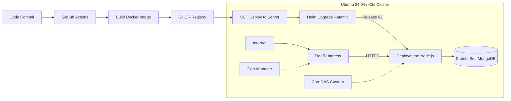

# 🚀 Migration: Legacy Node.js to Kubernetes (K3s)


Этот репозиторий содержит набор Kubernetes манифестов, Dockerfile для сборки образа и конфигурацию CI/CD пайплайна.

## 📋 О проекте
Проект решает задачу переезда с ручного запуска и мониторинга приложения (**Legacy-стиль**: файлы на диске + запуск процессом) на современную инфраструктуру: **Docker -> K3s -> CI/CD**.

### 🛠 Технологический стек
* **App:** Node.js, Express, MongoDB (Mongoose).
* **Infrastructure:** Ubuntu Server 24.04 (Bare-metal).
* **Orchestration:** Kubernetes (K3s).
* **Package Manager:** **Helm v3** (Управление релизами, шаблонизация).
* **Networking:** Traefik Ingress Controller.
* **Security:** Cert-Manager + Let's Encrypt (Auto HTTPS).
* **CI/CD:** GitHub Actions + GHCR (Container Registry).
* **Containerization:** Docker.

## 🏗️ Архитектура решения



## ⚙️ Функциональные возможности

### 1. Dockerfile
* Собирает оптимизированный образ на базе `node:20-alpine`.
* Использует `.dockerignore` для исключения мусорных файлов, секретов и локальных зависимостей.
* Поддерживает многоэтапную сборку (build stage) для фронтенда.

### 2. Helm Chart (Пакетирование)
Вместо разрозненных YAML-манифестов используется структура Helm Chart (`charts/arenda`):
* **Единая точка настройки:** Все параметры (порты, ресурсы, версии) вынесены в `values.yaml`.
* **Гибкость:** Шаблонизация позволяет легко менять переменные окружения и настройки Ingress под разные окружения.
* **Probes:** Настроены `livenessProbe` и `readinessProbe` для мониторинга здоровья подов, что гарантирует автоматический перезапуск зависших контейнеров.

### 3. CI/CD (GitHub Actions)
В рамках адаптации выполнен рефакторинг `server.js` для работы с переменными окружения (например, `MONGO_URI`). Реализован файл `.github/workflows/deploy.yml`, который:
* **Build:** Собирает образ и пушит его в GHCR с уникальным тегом (SHA коммита).
* **Deploy:** Заходит на сервер по SSH и выполняет helm upgrade.
* **Atomic:** Использует флаг --atomic. Если приложение не пройдет проверки здоровья за 5 минут, Helm автоматически откатит релиз назад.

## 🔥 Ключевые решения и Челленджи

### 1. Продвинутый GitOps с Helm
Переход на пакетный менеджер позволил реализовать:
* **Версионирование релизов:** Каждое обновление создает новую ревизию в истории Helm.
* **Идемпотентность:** Использование динамических тегов (`sha-xxxx`) вместо `latest` гарантирует, что кластер всегда обновляется на свежий код.
* **Zero Downtime:** Благодаря `readinessProbe`, трафик переключается на новые поды только после их полной готовности, исключая 503 ошибки для пользователей во время деплоя.

### 2. Надежная База Данных
MongoDB работает в режиме `StatefulSet` с Persistent Volume Claim (PVC). Это гарантирует, что при пересоздании подов или обновлении Helm данные (диск) остаются в безопасности и корректно переподключаются к новому процессу базы данных.

### 3. Решение проблемы Hairpin NAT
Сервер находится за NAT-роутером, который не поддерживает "петлевые" запросы (обращение к самому себе по внешнему IP).
* **Решение:** Настройка `CoreDNS` внутри кластера, чтобы домен разрешался во внутренний IP (`192.168.x.x`). Это критично для прохождения HTTP-валидации сертификатов Let's Encrypt.

### 4. Поддержка кириллических доменов (.РФ)
Настроен Ingress и сертификаты для работы с IDN (Internationalized Domain Names) через Punycode (`xn--...`), что позволило корректно подключить домен **куплюземлю.рф** и выпустить для него SSL сертификат.

### 5. Подробная инструкция по настройке мониторинга находится в MONITORING.md

## 🚀 Как запустить (Деплой)

Процесс полностью автоматизирован:

1.  Внесите изменения в код приложения или настройки Helm (`values.yaml`).
2.  Сделайте коммит и пуш в репозиторий:
    ```bash
    git add .
    git commit -m "feat: upgrade app logic"
    git push origin main
    ```
3.  Перейдите во вкладку **Actions** на GitHub. Пайплайн соберет новый образ, доставит чарт на сервер и безопасно обновит приложение.