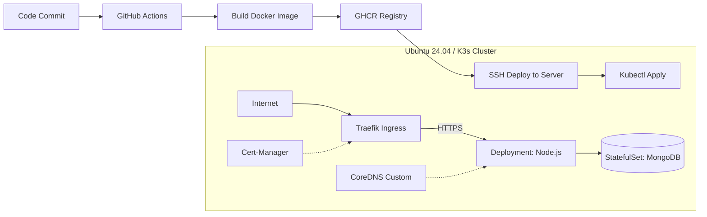

# 🚀 Migration: Legacy Node.js to Kubernetes (K3s)


Этот репозиторий содержит набор Kubernetes манифестов, Dockerfile для сборки образа и конфигурацию CI/CD пайплайна.

## 📋 О проекте
Проект решает задачу переезда с ручного запуска и мониторинга приложения (**Legacy-стиль**: файлы на диске + запуск процессом) на современную инфраструктуру: **Docker -> K3s -> CI/CD**.

### 🛠 Технологический стек
* **App:** Node.js, Express, MongoDB (Mongoose).
* **Infrastructure:** Ubuntu Server 24.04 (Bare-metal).
* **Orchestration:** Kubernetes (K3s).
* **Networking:** Traefik Ingress Controller.
* **Security:** Cert-Manager + Let's Encrypt (Auto HTTPS).
* **CI/CD:** GitHub Actions + GHCR (Container Registry).
* **Containerization:** Docker.

## 🏗️ Архитектура решения



## ⚙️ Функциональные возможности

### 1. Dockerfile
* Собирает оптимизированный образ на базе `node:20-alpine`.
* Использует `.dockerignore` для исключения мусорных файлов, секретов и локальных зависимостей.
* Поддерживает многоэтапную сборку (build stage) для фронтенда.

### 2. Легковесный Kubernetes (K3s)
Развертывание на сервере Ubuntu 24.04 с использованием трех основных компонентов:
* **MongoDB (`k8s/mongodb.yaml`):** Использование `StatefulSet` с Persistent Volume Claim (PVC) для надежного хранения данных базы.
* **Приложение (`k8s/app.yaml`):** `Deployment` для Node.js приложения, работающего через переменные окружения.
* **Ingress (`k8s/ingress.yaml`):** Настройка внешнего доступа через Traefik Ingress Controller.

### 3. CI/CD (GitHub Actions)
В рамках адаптации выполнен рефакторинг `server.js` для работы с переменными окружения (например, `MONGO_URI`). Реализован файл `.github/workflows/deploy.yml`, который:
* **Автоматизирует процесс:** Push в GitHub -> Сборка Docker -> Деплой на сервер.
* **Использует Registry:** Публикация образов в GitHub Container Registry (GHCR).
* **Безопасность:** Использование GitHub Secrets (`HOST`, `USERNAME`, `SSH_KEY`) для доступа к серверу.

## 🔥 Ключевые решения и Челленджи

### 1. Переход на Kubernetes (K3s)
Приложение мигрировано с ручного запуска (`pm2`) в кластер.
* **База данных:** MongoDB перенесена в `StatefulSet` для сохранения состояния.
* **Связь:** Настроена внутренняя сеть K8s, приложение обращается к базе по стабильному DNS-имени `mongodb-0.mongodb`.

### 2. Реализация GitOps Пайплайна
* При пуше в ветку `feature/*` или `main` запускается сборка.
* Манифесты Kubernetes копируются на сервер через SCP.
* Изменения применяются через `kubectl apply`, и происходит бесшовный перезапуск подов (`rollout restart`).

### 3. Решение проблемы Hairpin NAT
Сервер находится за NAT-роутером, который не поддерживает "петлевые" запросы, что блокировало самопроверку **Let's Encrypt**.
* **Решение:** Настройка `CoreDNS` внутри кластера (NodeHosts), чтобы домен разрешался во внутренний IP (`192.168.x.x`), минуя роутер.

### 4. Поддержка кириллических доменов (.РФ)
Настроен Ingress и сертификаты для работы с IDN (Internationalized Domain Names) через Punycode (`xn--...`), что позволило корректно подключить домен **куплюземлю.рф** и выпустить для него SSL сертификат.

## 🚀 Как запустить (Деплой)

1.  Внесите изменения в код приложения.
2.  Сделайте коммит и пуш в ветку:
    ```bash
    git add .
    git commit -m "Feature: обновление логики"
    git push origin main
    ```
3.  Перейдите во вкладку **Actions** на GitHub и следите за пайплайном:
    * **Build and Push:** Сборка и отправка в GHCR.
    * **Deploy:** Обновление манифестов на сервере.

После завершения (зеленая галочка) приложение обновится автоматически без простоя (Zero Downtime).

